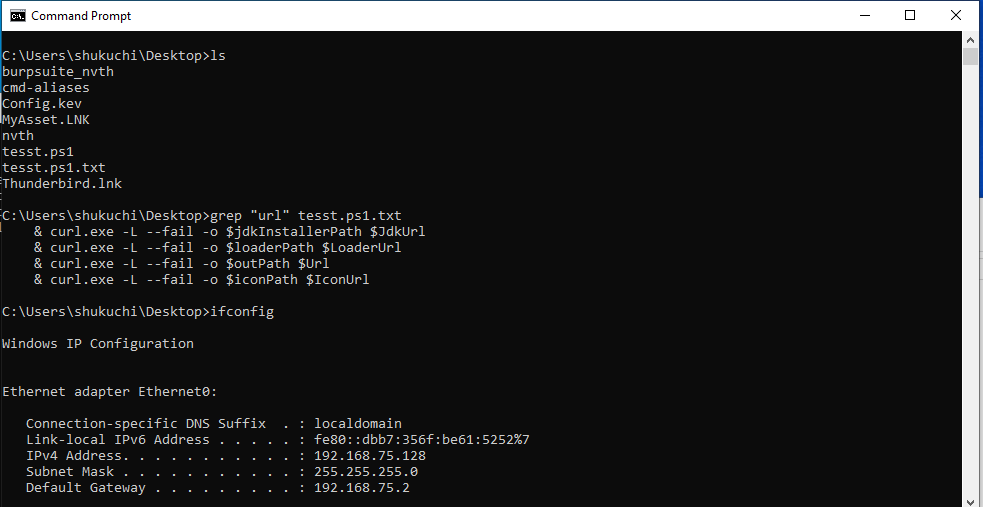

Command Prompt aliases (Linux-style, e.g., `ls` instead of `dir`)

Clone repo
`git clone https://github.com/nvth/cmd-aliases.git`

Quick setup (recommended)
1. Double-click `setup-aliases.bat`.

This will:
- Create `C:\alias\cmd.cmd` with only the `ls` alias.
- Import `autorun-hkcu.reg` so `cmd` auto-loads aliases.

Add more aliases
Edit `C:\alias\cmd.cmd` and add more `DOSKEY` lines.

Example `cmd.cmd`:
@echo off
DOSKEY ls=dir /B $*

Manual setup (optional)
1. Create `C:\alias\cmd.cmd` with your `DOSKEY` commands.
2. Import `autorun-hkcu.reg` (double-click), or:
   - Open Registry Editor (`regedit`).
   - Go to `HKEY_CURRENT_USER\Software\Microsoft\Command Processor`.
   - Add a String Value named `AutoRun` with value `C:\alias\cmd.cmd`.

Windows 10 / 11 (optional, system-wide)
Repeat the `AutoRun` value under:
`HKEY_LOCAL_MACHINE\SOFTWARE\Microsoft\Command Processor`

If you do not see `Command Processor`, create the key with that exact name.

Result

Command reference (DOSKEY aliases in `cmd.cmd`)
| Alias | DOSKEY target | Explanation |
| --- | --- | --- |
| `ls` | `dir /B $*` | List files/folders (bare format). |
| `pwd` | `cd` | Show current directory. |
| `cd` | `cd $*` | Change directory. |
| `mkdir` | `mkdir $*` | Create directory. |
| `rmdir` | `rmdir $*` | Remove empty directory. |
| `rm` | `del $*` | Delete file. |
| `rmrf` | `rmdir /S /Q $*` | Remove directory recursively. |
| `cp` | `copy $*` | Copy file. |
| `cpr` | `xcopy $* /E` | Copy directory recursively. |
| `mv` | `move $*` | Move/rename. |
| `cat` | `type $*` | Show file contents. |
| `less` | `more $*` | Paginated view. |
| `grep` | `findstr $*` | Search text. |
| `grepr` | `findstr /S $*` | Recursive search. |
| `find` | `dir /s $*` | Find files by pattern (recursive). |
| `ps` | `tasklist $*` | List processes. |
| `kill` | `taskkill /PID $*` | Kill process by PID. |
| `top` | `taskmgr` | Open Task Manager. |
| `whoami` | `whoami` | Show current user. |
| `ip` | `ipconfig $*` | Show IP configuration. |
| `ipr` | `route print` | Show route table. |
| `ping` | `ping $*` | Ping host. |
| `ss` | `netstat -ano` | Show connections/ports. |
| `curl` | `curl $*` | HTTP request (requires `curl`). |
| `ifconfig` | `ipconfig` | Linux-style alias for IP config. |
| `kali` | `ssh kali@192.168.56.133` | SSH to internal `kali` host. |
| `mobsf` | `docker run -it --rm -p 8000:8000 opensecurity/mobile-security-framework-mobsf:latest` | Run MobSF container on port 8000. |
| `semgrep` | `docker run --rm -v "%cd%:/src" returntocorp/semgrep semgrep $*` | Run Semgrep in Docker (mount current directory). |
